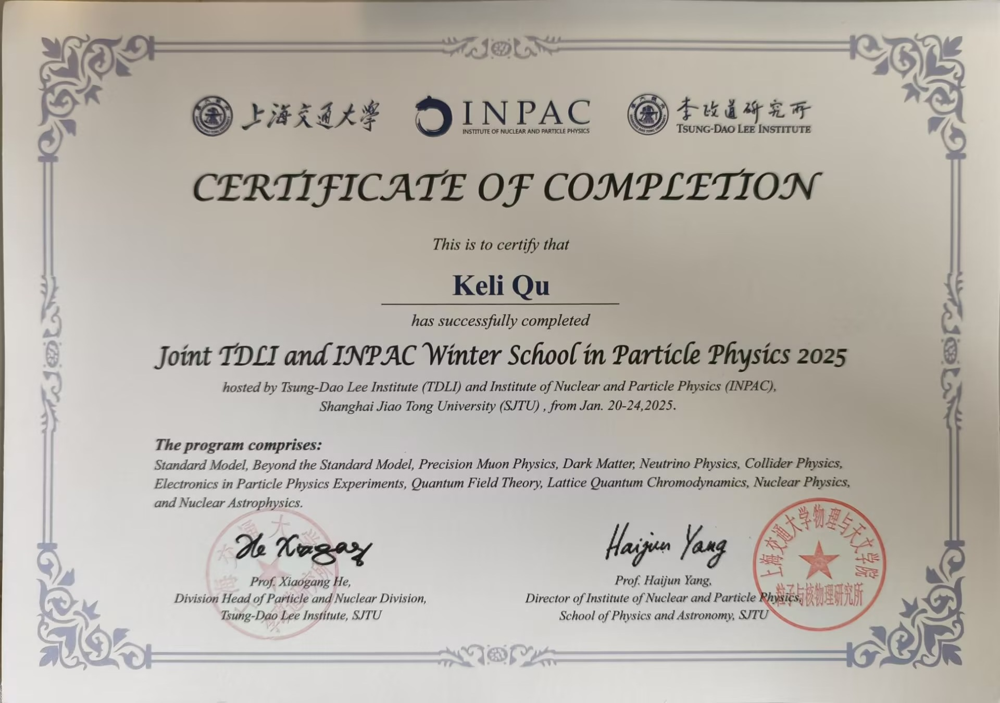



# Curriculum Vitae

  <strong>KeLi Qu</strong>
   
  Shandong University | <a href="https://david71764.github.io/">My Home Page</a>
   
  Phone: +86 173-9173-5297 | Email: <a href="mailto:keliqu@mail.sdu.edu.cn">keliqu@mail.sdu.edu.cn</a>

## Education
---
**City University of Hong Kong** \
*Exchange student | Major in Mathematics and Physics* \
**2025.08.25--2025.12.23**

* **Core Courses**: Applied Differential Geometry, Quantum Mechanics, RadioTherapy Physics
* **Research Project**: QCNN for HEP data analysis, Applications of Reinforcement Learning in Quantum Computing and Quantum Information

 

**Shandong University** \
*B.Sc. in Physics(Honors Class) | GPA: 88.64/100* \
**2022.09--present**

* **Core Courses**: Quantum Mechanics, Group Theory, Introduction to Experimental Methods in Particle Physics, Computational Physics and Experiment
* **Research Project**: ATLAS experiment at the LHC, Thermal properties of ultra-wide bandgap semiconductor and thermal management of devices

## Research Experience
---
**Summer Research | Prof. WANG Xin Sunny** \
*QCNN for High Energy Physics data analysis* \
*06/2025--08/2025*
* Basic knowledge of quantum computing and quantum information
* Familiar with Python library for QIQC and Quantum Machine Learning
* As the demand for analyzing massive datasets in high-energy physics continues to grow, quantum machine learning has demonstrated quantum supremacy in certain problems, highlighting its increasing importance for data analysis in future high-luminosity LHC experiments. Inspired by the particle track identification algorithm used in the Deep Underground Neutrino Experiment (DUNE), using quantum convolutional neural network to construct a classifier for top quark jet image.

 

**Research Project 2 | Prof. Yanlin Liu** \
*ATLAS experiment at the LHC* \
*09/2024--Present*
* Learned Python computational science and data analysis methods
* Learn to use Boosted Decision Tree methods (implemented via XGBoost), develop a signal-to-background discrimination scheme to analyze the VBF and ggF processes of the $H\to\mu\mu$ in the ATLAS experiment.
* Familiar with the workflow of working on the CERN Lxplus

 

**Research Project 1 | Prof. Jiayue Yang** \
*Thermal properties of ultra-wide bandgap semiconductor and thermal management of devices* \
*01/2024-06/2024*
* Basic knowledge of machine learning
* Familiar with the use of LAMMPS(Large-scale Atomic/Molecular Massively Parallel Simulator)
* Studied molecular dynamics and finite element methods in the research of microchannel heat dissipation and thermoelectric coupling of devices

## Lab Skills
---
* **Quantum Computing and Quantum Information:** Python library for QIQC and QML
* **Particle Physics:** Familiar with the workflow at CERN Lxplus and Gitlab
* **Semiconductor Physics:** Finite element analysis, Molecular dynamics simulation
* **Programming Skills:** Python, LAMMPS, Shell, Wolfram Mathematica

## Awards & Honors
---
* **2025:** **Joint TDLI and INPAC Winter School in Particle Physics** | Successfully completed
* **2024:** **China Undergraduate Mathematical Contest in Modeling** | Second prize in Shandong province
* **2023:** **Algorithm Competition for College Students** | Excellence Award in Group A
* **2022:** **Mathematics competition of Chinese College Student** | Third prize in Shandong province

## Appendix
---

